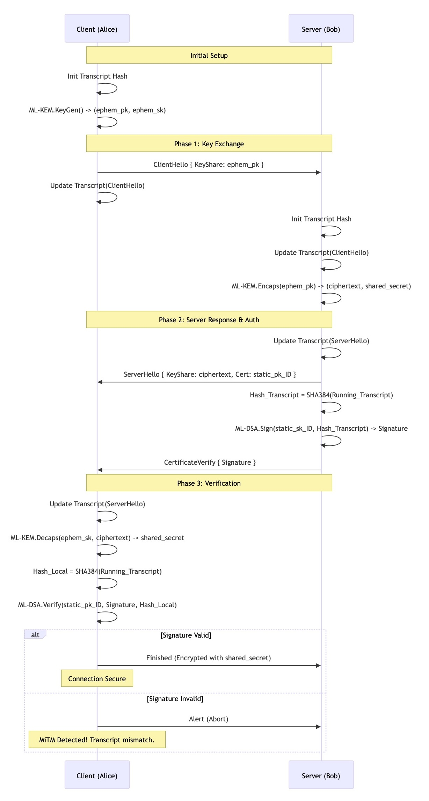

# TLS 1.3 Hybrid PQC Handshake Simulation

A lightweight Golang demonstration illustrating how **TLS 1.3** secures unauthenticated Post-Quantum Key Exchange (**ML-KEM**) against Man-in-the-Middle (MiTM) attacks using Digital Signatures (**ML-DSA**).

This project simulates the cryptographic "binding" logic used in modern hybrid Post-Quantum Cryptography standards (e.g., Kyber + Dilithium) without requiring heavy external C-libraries (like `liboqs`), making it easy to study the protocol flow.

## ⚡ Overview

In a raw Key Encapsulation (ML-KEM) exchange, an attacker can intercept and swap public keys. TLS 1.3 prevents this by binding the ephemeral key exchange to a static identity via a **Signed Transcript Hash**.

This demo implements:
1.  **Client/Server Processes:** Two concurrent goroutines communicating via an in-memory network pipe.
2.  **ML-KEM Simulation:** Modeling the `KeyGen` -> `Encaps` -> `Decaps` flow.
3.  **ML-DSA Simulation:** Using Ed25519 to model the signature authentication flow.
4.  **Transcript Verification:** The core logic that detects and prevents MiTM attacks.

## 🛠 The Algorithm

The handshake follows the TLS 1.3 state machine:

1.  **Key Generation:** Client generates an ephemeral ML-KEM keypair.
2.  **ClientHello:** Client sends the Public Key (`pk_client`) to Server.
    *   *Internal:* Client updates its local Transcript Hash.
3.  **Encapsulation:** Server receives `pk_client`, generates a Shared Secret, and encapsulates it (`ciphertext`).
4.  **ServerHello:** Server sends `ciphertext` and its Static Public Identity (`pk_identity`).
    *   *Internal:* Server updates its local Transcript Hash.
5.  **Authentication (The Fix):** 
    *   Server signs the **Transcript Hash** (which contains `pk_client` + `ciphertext`) using its long-term Private Key.
    *   Server sends this signature in `CertificateVerify`.
6.  **Verification:**
    *   Client calculates the hash of its own transcript.
    *   Client verifies the Server's signature against this local hash.
    *   **Result:** If a MiTM modified the keys in Step 2, the hashes mismatch, the signature fails, and the connection aborts.



```Mermaid
sequenceDiagram
    participant C as Client (Alice)
    participant S as Server (Bob)
    
    Note over C,S: Initial Setup
    C->>C: Init Transcript Hash
    C->>C: ML-KEM.KeyGen() -> (ephem_pk, ephem_sk)
    
    Note over C,S: Phase 1: Key Exchange
    C->>S: ClientHello { KeyShare: ephem_pk }
    C->>C: Update Transcript(ClientHello)
    
    S->>S: Init Transcript Hash
    S->>S: Update Transcript(ClientHello)
    S->>S: ML-KEM.Encaps(ephem_pk) -> (ciphertext, shared_secret)
    
    Note over C,S: Phase 2: Server Response & Auth
    S->>S: Update Transcript(ServerHello)
    S->>C: ServerHello { KeyShare: ciphertext, Cert: static_pk_ID }
    
    S->>S: Hash_Transcript = SHA384(Running_Transcript)
    S->>S: ML-DSA.Sign(static_sk_ID, Hash_Transcript) -> Signature
    S->>C: CertificateVerify { Signature }
    
    Note over C,S: Phase 3: Verification
    C->>C: Update Transcript(ServerHello)
    C->>C: ML-KEM.Decaps(ephem_sk, ciphertext) -> shared_secret
    
    C->>C: Hash_Local = SHA384(Running_Transcript)
    C->>C: ML-DSA.Verify(static_pk_ID, Signature, Hash_Local)
    
    alt Signature Valid
        C->>S: Finished (Encrypted with shared_secret)
        Note over C: Connection Secure
    else Signature Invalid
        C->>S: Alert (Abort)
        Note over C: MiTM Detected! Transcript mismatch.
    end
```

## 🚀 Getting Started

### Prerequisites
*   **Go 1.18+** installed.

### Installation
Clone the repository:

```bash
git clone https://github.com/alain2sf/tls13-pqc-mitm-demo.git
cd tls13-pqc-mitm-demo
```
### Build and Run

```bash
go build ./cmd/tls13-pqc-mitm-demo
./tls13-pqc-mitm-demo
```

### Sample Output
```bash
---------------------------------------------------------
  TLS 1.3 Hybrid PQC Handshake Demo (Go Simulation)
  Goal: Prevent MiTM using ML-KEM + ML-DSA
---------------------------------------------------------
[SERVER] Booted. Loaded Static ML-DSA Identity: 243a77e7...
[CLIENT] Starting Handshake...
[CLIENT] Generated Ephemeral ML-KEM Keypair.
   PK: 6a3d6590...
[CLIENT] Sending ClientHello...
[SERVER] Received ClientHello.
   Client PK: 6a3d6590...
[SERVER] Encapsulated Shared Secret against Client PK.
[SERVER] Sending ServerHello (Ciphertext + ID).
[CLIENT] Received ServerHello.
   Ciphertext: 381f6b78...
   Server Static ID: 243a77e7...
[CLIENT] Decapsulated Shared Secret: SHARED_SECRET_ESTABLISHED
[SERVER] Signing Transcript Hash: 92a090595e414523...
[SERVER] Sending CertificateVerify.
[CLIENT] Received CertificateVerify (Signature).
[CLIENT] Calculated Local Transcript Hash: 92a090595e414523...
[CLIENT] SUCCESS: Signature Validated! Connection Secure.
[CLIENT] The keys exchanged are bound to the Server's Identity.
---------------------------------------------------------
```

### ⚠️ Disclaimer
**Educational Use Only.**

This code uses standard Go crypto primitives (Ed25519, SHA256) and random bytes to simulate the API flow of ML-KEM and ML-DSA. It is designed to demonstrate the protocol logic (Transcript Binding), not to provide a production-ready implementation of lattice-based cryptography.
